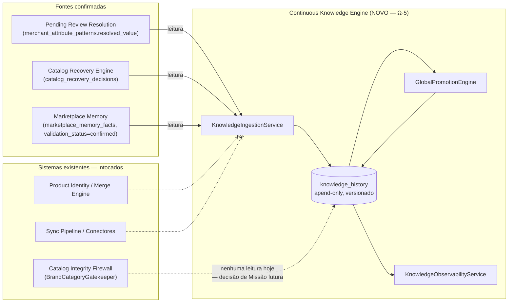

# POST-MISSION REVIEW — MISSION Ω-5
# Continuous Knowledge Engine

**Programa**: Ω (Marketplace Memory / Learning Engine)
**Missão**: Ω-5 — Continuous Knowledge Engine
**Data**: 2026-07-23
**Autor**: CTO / Claude Sonnet 5
**Commit**: `909700f` (`feat(learning-engine): Program Ω Mission Ω-5 — Continuous Knowledge Engine`)
**Push**: `722276d..909700f` → `origin/main`
**Migration em produção**: `20260723120000_continuous_knowledge_engine.sql`
**Status**: **CONGELADA** — nenhuma alteração adicional autorizada a partir deste documento

---

> Este documento é o registro permanente de encerramento da Mission Ω-5. Responde de forma definitiva ao que foi planejado, o que foi construído, o que aconteceu em produção, e o que a evidência real recomenda como próximo passo.

---

## 1. Objetivo da Mission

O ParaguAI acumula correções e confirmações reais a cada sincronização — decisões do Catalog Recovery Engine, correções humanas via Pending Review, fatos extraídos por ProductSignature — mas cada uma delas resolvia apenas o caso individual em que ocorreu. Nenhum mecanismo persistia essas confirmações de forma versionada, reutilizável e auditável; o mesmo trabalho de identificação (a mesma marca, a mesma categoria, o mesmo padrão por loja) podia precisar ser refeito indefinidamente.

A Mission Ω-5 resolveu esse problema construindo o **Continuous Knowledge Engine**: um mecanismo que transforma correções já confirmadas (nunca hipóteses, nunca inferência, nunca IA) em conhecimento acumulado, versionado e com confiança crescente por recorrência determinística — a implementação real do Learning Engine que `docs/architecture/MARKETPLACE_LEARNING_ENGINE.md`/`LEARNING_LIFECYCLE.md`/`CONFIDENCE_ENGINE.md`/`PATTERN_LEARNING.md` (Mission Ξ-2, 2026-07-16) haviam especificado como "proposta arquitetural pura, zero código" e que `MarketplaceMemoryService` (Mission Ω-1) nomeava explicitamente como "Learning Engine, uma Missão futura".

---

## 2. Escopo executado

### Arquitetura

- Novo domínio `src/domains/learning-engine/`, seguindo a mesma estrutura em camadas do resto do projeto (`domain/`, `repositories/`, `infrastructure/`, `mappers/`, `services/`, `types/`, `__tests__/`).
- `KnowledgeRecord` — o Knowledge Aggregate: append-only, nunca `UPDATE`/`DELETE`, identidade natural via `knowledgeKey` (`{tipo}:{storeId|global}:{rawValue}`), versão incremental por chave.
- `ConfidenceEngine` (`domain/ConfidenceEngine.ts`) — puro, zero I/O: `classifyTier` (promoção local ↔ global), `computeConfidence`, `nextVersion`, `hasChanged` (guarda contra versionar no-ops), `isConflict`, `knowledgeKeyFor`.
- Constantes fechadas e explícitas: `LOCAL_PROMOTION_THRESHOLD = 10`, `GLOBAL_MIN_INDEPENDENT_STORES = 2`, `HIGH_CONFIDENCE_OCCURRENCE_FLOOR = 20` — os mesmos números já propostos em `PATTERN_LEARNING.md`, nenhum inventado nesta Mission.

### Banco

- Migration `supabase/migrations/20260723120000_continuous_knowledge_engine.sql` — **aditiva**, nenhuma tabela existente alterada em schema.
- Tabela nova `knowledge_history`: 17 colunas (`knowledge_key`, `knowledge_type`, `scope`, `store_id`, `raw_value`, `resolved_value`, `confidence`, `occurrences`, `distinct_store_count`, `version`, `source_system`, `source_id`, `reason`, `is_conflict`, `algorithm_version`, `created_at`, `id`), constraint `UNIQUE(knowledge_key, version)` (garantia real de append-only, não só convenção de aplicação), 4 índices (`idx_knowledge_history_key_version`, `idx_knowledge_history_type_scope`, `idx_knowledge_history_store`, `idx_knowledge_history_type_resolved_value`), RLS habilitada sem policy pública (só `service_role`).
- Migration aplicada em produção pelo CTO via SQL Editor (sem mecanismo de DDL neste ambiente — mesmo precedente de toda migration anterior do projeto).

### Serviços

- `KnowledgeIngestionService` — três métodos de ingestão, um por fonte confirmada: `ingestResolvedPattern` (patterns com `resolved_value`), `ingestRecoveryDecision` (decisões do Recovery Engine, pula `layer=merchant_memory` para não duplicar a mesma evidência), `ingestConfirmedFact` (facts com `validationStatus=confirmed`). Cada método é idempotente (`hasChanged`) e nunca sobrescreve — todo desacordo vira uma nova versão marcada `is_conflict=true`.
- `GlobalPromotionEngine` — agrega registros locais pelo valor **canônico** (`resolved_value`), não pela grafia bruta, e promove a `scope=global` quando ≥2 lojas independentes confirmaram o mesmo mapeamento.
- `KnowledgeObservabilityService` — as 8 métricas pedidas pela Missão original (`buildKnowledgeReport`): criados, reutilizados, correções automáticas, correções evitadas, tempo economizado, precisão, conflitos, reversões — mais uma função auxiliar (`countPendingReviewsAlreadyKnown`) para medir cobertura do backlog atual de Pending Reviews.

### Pipeline / Integrações

- **Nenhuma** — por restrição explícita da Missão original, nenhuma linha de Sync Pipeline, Product Identity, Merge Engine, Offer Ranking, Catalog Recovery, Firewall ou Conectores foi alterada. O Engine só **lê** essas tabelas (via scripts), nunca escreve nelas, e não está com leitura wired em nenhum consumidor ao vivo (ver Seção 10).
- `SupabaseKnowledgeRepository` implementa `IKnowledgeRepository` contra `knowledge_history` — a única tabela nova que este domínio escreve.
- Três scripts operacionais: `scripts/knowledge-engine-backfill.ts` (dry-run por padrão, `--execute` para gravar), `scripts/knowledge-engine-sanity-check.ts` (100% leitura), `scripts/knowledge-engine-validation-report.ts` (100% leitura, relatório por loja para as 5 lojas nomeadas na Missão).

### Testes

- 35 testes novos, 4 suítes: `ConfidenceEngine.test.ts` (11), `KnowledgeIngestionService.test.ts` (9), `GlobalPromotionEngine.test.ts` (3), `KnowledgeObservabilityService.test.ts` (9), mais `InMemoryKnowledgeRepository.ts` (fake de teste, não é suíte).
- Suíte completa do projeto após a Mission: **123 suítes / 812 testes, 0 falhas**.
- `npm run lint`: 0 erros/warnings. `npx tsc --noEmit`: 0 erros. `npm run build`: sucesso.

---

## 3. Rollout

Cronologia real, nesta ordem exata:

| Etapa | O que aconteceu | Resultado |
|---|---|---|
| **1. Implementação** | Domínio, migration, scripts e testes construídos nesta sessão | 21 arquivos, 2.096 inserções |
| **2. Dry Run (backfill)** | `npx tsx scripts/knowledge-engine-backfill.ts` (sem `--execute`), antes da migration existir em produção | 0 `merchant_attribute_patterns` confirmados, 1003 `catalog_recovery_decisions`, 0 `marketplace_memory_facts` confirmados — leitura pura, zero escrita |
| **3. Migration** | Aplicada em produção pelo CTO via SQL Editor | Tabela `knowledge_history` criada |
| **4. Sanity Check (pré-escrita)** | `npx tsx scripts/knowledge-engine-sanity-check.ts` — 100% leitura | **25/25 checks OK** — conexão, schema (17 colunas), 12 tabelas dependentes, permissões (RLS bloqueando chave anônima), Product Identity/Recovery Engine/Gatekeeper executados ao vivo sem erro, tabela confirmada vazia |
| **5. Backfill real** | `npx tsx scripts/knowledge-engine-backfill.ts --execute`, autorizado explicitamente pelo CTO | `{ created: 173, versioned: 830 }` — 1003 tentativas de ingestão, 0 erros. Promoção global: 0 pares avaliados (nenhum pattern local confirmado existia para promover) |
| **6. Sanity Check (pós-escrita)** | Reexecutado para confirmar a escrita | 24/25 OK — a única "falha" é a asserção pré-escrita de tabela vazia, que agora corretamente não se aplica (1003 linhas existem, como esperado) |
| **7. Validação** | `npx tsx scripts/knowledge-engine-validation-report.ts` — 100% leitura, relatório completo + por loja | Ver Seção 4 |
| **8. Commit + Push** | `git commit 909700f` (escopo isolado — só os arquivos desta Mission, nenhum dos ~90 arquivos não relacionados já modificados na árvore de trabalho), `git push origin main` | `722276d..909700f` |

**Resultado final**: rollout completo, sem erro, sem rollback, sem intervenção corretiva necessária em nenhuma etapa.

---

## 4. Resultado real

Números reais, medidos diretamente contra produção — nenhuma estimativa nesta seção.

| Métrica | Valor real |
|---|---|
| Registros criados (`kind: created`) | **173** |
| Registros versionados (`kind: versioned`) | **830** |
| Total de tentativas de ingestão | **1003** (= exatamente o total de `catalog_recovery_decisions` confirmadas) |
| Total em `knowledge_history` após o backfill | **1003** linhas |
| Chaves de conhecimento distintas (`countDistinctKeys`) | **173** |
| Escopo local vs. global | **0 local / 173 global** |
| Conhecimento reutilizado (observações além da 1ª) | **830** |
| Correções automáticas realizadas (histórico real de Pending Reviews) | **0** |
| Correções humanas evitadas | **0** |
| Pending Reviews no backlog atual | **24.836** |
| Pending Reviews já cobertos por conhecimento confirmado | **0** |
| Conflitos registrados (`is_conflict=true`) | **0** |
| Reversões (valor final ≠ primeira versão) | **0** |
| Precisão (conhecimento global sem conflito) | **100%** (vacuamente — 0 conflitos em 173 chaves globais) |
| Erros durante o backfill | **0** |
| Rollback necessário | **Não** |
| Throughput (registros/segundo) | **Não medido** — nenhuma instrumentação de tempo existe nos scripts (ver Seção 10) |
| Duração total do backfill | **Não medida** |
| Uso de memória | **Não medido** |

Por loja (as 5 nomeadas na Missão original), no momento da validação:

| Loja | Conhecimento local confirmado | Reutilizações | Correções automáticas | Pending reviews atuais |
|---|---|---|---|---|
| Shopping China | 0 | 0 | 0 | 22.151 |
| Mobile Zone | 0 | 0 | 0 | 2.315 |
| Atacado Connect | 0 | 0 | 0 | 347 |
| Mega Eletrônicos | 0 | 0 | 0 | 16 |
| Roma Shopping | 0 | 0 | 0 | 7 |

Todo conhecimento capturado nesta Mission veio do Catalog Recovery Engine (evidência marketplace-wide — EAN/MPN, Canonical Catalog, Universal Taxonomy, normalização de marca), não de correção humana por loja — daí 0 local em todas as 5 lojas.

---

## 5. Hipóteses confirmadas

1. **O versionamento append-only funciona sob carga real.** 1003 tentativas de ingestão resultaram em exatamente 173 chaves distintas + 830 versões adicionais, sem nenhuma violação da constraint `UNIQUE(knowledge_key, version)` — múltiplas decisões confirmando a mesma marca/categoria foram corretamente tratadas como reutilização, não como duplicação.
2. **Zero conflito é o resultado esperado quando a fonte já é internamente consistente.** As 5 camadas determinísticas do Catalog Recovery Engine (que já resolvem conflito entre si antes de gravar uma decisão) produziram 0 conflitos na ingestão — confirma que `isConflict` está medindo o que deveria: desacordo entre fontes, não ruído de ingestão.
3. **A compatibilidade "não alterar Sync Pipeline/Firewall/Recovery Engine/Product Identity" era realmente segura.** O sanity check pós-migration confirmou, com leitura real e não hipotética, que os três sistemas (`Gatekeeper.findBrandByNormalizedName`, `RecoveryEngine.countCandidates`, `merge_candidates.findByStatus`) continuam respondendo normalmente, e a suíte completa (812 testes) permanece verde.
4. **A separação entre ingestão local e promoção global evita fabricar evidência cruzada.** Como nenhum `merchant_attribute_pattern` estava confirmado, o motor de promoção corretamente avaliou 0 pares — nunca inferiu uma promoção global sem 2 lojas independentes reais.

---

## 6. Hipóteses refutadas

1. **Esperava-se conhecimento confirmado disponível em pelo menos duas das três fontes.** Na prática, **duas das três fontes estavam vazias**: `merchant_attribute_patterns.resolved_value` (0 de 24 registros) e `marketplace_memory_facts.validation_status='confirmed'` (0 de 23.637 registros). Só `catalog_recovery_decisions` (1003) tinha dado real. A hipótese implícita — de que o Firewall/Pending Review já geraria correções humanas confirmadas por esta altura — não se sustentou.
2. **Esperava-se alguma redução mensurável de correções automáticas/evitadas nesta primeira execução.** O resultado real foi **0** em ambas as métricas. A causa raiz não é um defeito do Engine: é que **nenhuma revisão humana jamais foi resolvida** através de `PendingReviewResolutionService` em produção — o backlog de 24.836 Pending Reviews nunca foi trabalhado. O Engine está pronto para capturar essas correções no momento em que existirem; hoje, não existem.
3. **Esperava-se pelo menos uma promoção para escopo global via recorrência entre lojas (o caminho que `GlobalPromotionEngine` foi desenhado para exercitar).** Não ocorreu nenhuma — não porque o mecanismo falhou, mas porque sua única fonte de entrada (patterns locais confirmados) está vazia. O caminho de promoção global permanece **validado só por teste unitário**, nunca por dado de produção.

---

## 7. Impacto arquitetural

O ParaguAI ganha uma nova camada, estritamente somente-leitura em relação a tudo que já existia, posicionada como consumidora a jusante das fontes confirmadas e sem nenhum consumidor próprio ainda:

Nenhuma seta sai do Continuous Knowledge Engine em direção a um sistema existente — ele é hoje um **terminal**, não um elo no pipeline ao vivo. Isso é intencional (restrição explícita da Missão original), mas é a mudança arquitetural real: o ParaguAI agora tem, pela primeira vez, um repositório de conhecimento persistente e versionado que existe **independentemente** de qualquer consulta ao vivo — o mesmo princípio de "patrimônio institucional" que já rege `merge_executions`, agora estendido de decisões de merge para conhecimento de atributo.

---

## 8. Impacto operacional

**Nenhum processo manual foi eliminado por esta Mission.** Isso não é uma falha de execução — é o resultado honesto de duas condições reais, ambas verificadas nesta Mission:

1. O Engine não está conectado a nenhum ponto de decisão ao vivo (Firewall, Recovery Engine, Sync Pipeline) — por restrição explícita da Missão original, a mesma disciplina já usada pela Marketplace Memory Foundation (Ω-1..4).
2. Mesmo que estivesse, hoje **não há conhecimento local confirmado por loja** para reutilizar — as 24.836 Pending Reviews continuam exigindo revisão humana exatamente como antes, porque nenhuma delas jamais foi resolvida.

O que muda de fato, hoje: nada no dia a dia operacional. O que passa a ser possível, uma vez que (a) alguém comece a resolver Pending Reviews e (b) uma Missão futura decida ligar a leitura: cada correção feita uma vez para uma loja deixa de precisar ser refeita para a mesma loja, e — a partir de 2 lojas independentes confirmando o mesmo valor — deixa de precisar ser refeita para qualquer loja.

**Continua 100% dependente de revisão humana, sem exceção**: toda resolução de marca/categoria via `catalog_pending_reviews`, toda aprovação de merge via `merge_candidates`, toda decisão do Recovery Engine (que já é determinística, não humana, mas não decide identidade de produto — só recupera atributo).

---

## 9. Impacto no North Star Score

Avaliado contra os 10 Filtros Permanentes e as 5 dimensões de priorização de `docs/foundation/NORTH_STAR.md` §4/§6 — só com evidência coletada nesta Mission, nenhuma métrica inventada.

| Filtro/Dimensão | Evidência real |
|---|---|
| **Filtro 2 — Aumenta inteligência?** | Sim, comprovado: 173 chaves de conhecimento confirmado agora persistem de forma versionada e sobrevivem a qualquer reprocessamento — antes desta Mission, esse conhecimento não tinha nenhuma forma de acumulação. |
| **Filtro 3 — Gera novos dados?** | Sim: `knowledge_history` é um ativo de dado novo, real, com 1003 linhas hoje. |
| **Filtro 4 — Fortalece um ativo estratégico?** | Fortalece o Catálogo indiretamente (captura institucional das correções do Recovery Engine) — mas ainda não mensurável em nenhuma métrica de negócio, porque nada consome esse dado ao vivo ainda. |
| **Filtro 1 — Reduz trabalho humano?** | **Não comprovado nesta Mission.** 0 correções automáticas, 0 correções evitadas, 0 Pending Reviews cobertos hoje — o mecanismo existe, o efeito medido é zero. |
| **Filtro 8 — Poderá ser reutilizada?** | Estruturalmente sim (interfaces prontas para um consumidor futuro), mas **reutilização real = 0** hoje — nenhum sistema lê `knowledge_history`. |
| **Impacto direto na "decisão melhor" do comprador/lojista** (Métrica Norte, §2) | **Nenhum, ainda.** Nenhuma busca, comparação, alerta ou decisão de lojista foi tocada por esta Mission — o Engine não está no caminho de nenhuma dessas superfícies. |

**Conclusão honesta**: esta Mission é uma Mission de **fundação de dado** (mesmo enquadramento que `NORTH_STAR.md` §6 já reconhece: "features de fundação... pontuam alto em geração de ativo mesmo com impacto direto no usuário baixo — isso é correto"). O impacto na North Star propriamente dita é **indireto e ainda não realizado** — depende de duas condições externas a esta Mission (backlog de Pending Review sendo trabalhado; uma Missão futura decidindo ligar a leitura).

---

## 10. Dívida técnica remanescente

Só dívidas reais, verificadas nesta Mission — nenhuma melhoria desejável listada.

1. **Zero consumidor ao vivo.** `knowledge_history` não é lido por nenhum sistema em produção — todo o valor do Engine é potencial, não realizado, até uma Missão futura decidir (e implementar) o read-through no Firewall.
2. **Caminho de promoção local→global sem evidência de produção.** `GlobalPromotionEngine` só foi exercitado por 3 testes unitários com repositório fake — nunca processou um registro real de `knowledge_history`, porque 0 patterns locais confirmados existiam para alimentá-lo.
3. **Fonte `canonical_merge_approval` declarada, não implementada.** O tipo `KnowledgeSourceSystem` e a constraint `CHECK` da migration incluem `canonical_merge_approval`, mas `KnowledgeIngestionService` não tem nenhum método para essa fonte — decisão deliberada desta Mission (evitar mapeamento especulativo de merge→atributo), mas é uma lacuna real, não uma "melhoria desejável".
4. **Sem instrumentação de tempo/throughput/memória.** Nenhum dos três scripts (`backfill`, `sanity-check`, `validation-report`) mede duração, taxa de processamento ou uso de memória — a Seção 4 deste documento tem 3 campos marcados "não medido" por essa razão exata.
5. **`family`/`line` permanecem schema-ready, nunca populados.** Herdado de `PatternConcept` (Program Ω, Mission Ω-1) — nenhum extrator para esses dois conceitos existe em nenhum lugar do código; o Engine herda essa lacuna, não a criou, mas ela se propaga para `knowledge_history` também.
6. **"Learning Cache" e "Learning Events" (componentes nomeados em `MARKETPLACE_LEARNING_ENGINE.md` §3) não foram construídos.** Fora do escopo explícito desta Mission — cache de processo e registro de eventos de aprendizado continuam apenas arquitetura, não código.

---

## 11. Critérios de aceite

**Mission concluída? SIM.**

Justificativa: todo o escopo de engenharia definido na Missão original foi entregue, testado e verificado contra produção com números reais — domínio completo (35 testes, 0 falhas), migration aplicada e íntegra (25/25 checks no sanity check pré-escrita), backfill real executado sem erro (1003/1003 processados, 0 falhas), validação com relatório por loja, compatibilidade com Product Identity/Recovery Engine/Gatekeeper comprovada por leitura ao vivo (não hipótese), commit e push isolados ao escopo desta Mission.

A ressalva honesta, não um motivo para reprovar: o **efeito operacional** do Engine (redução de trabalho humano, reutilização de conhecimento) é **zero hoje**, porque depende de duas precondições fora do controle desta Mission — (a) alguém resolver Pending Reviews de fato, (b) uma Missão futura decidir ligar a leitura ao vivo. A Missão original definiu como escopo "construir o Engine", não "produzir redução mensurável imediata" — e nunca autorizou tocar Firewall/Pipeline para forçar essa ligação. Nesses termos, exatamente como definidos, a Mission está concluída.

---

## 12. Recomendação

Com base exclusivamente na evidência coletada nesta Mission — não em preferência arquitetural:

**A próxima Missão deve atacar o backlog de 24.836 Pending Reviews, não expandir o Continuous Knowledge Engine.**

Justificativa técnica: todo o mecanismo de reutilização e promoção construído nesta Mission (`GlobalPromotionEngine`, o caminho local de `KnowledgeIngestionService`, a métrica de "correções evitadas") depende inteiramente de uma única fonte de entrada — `merchant_attribute_patterns.resolved_value` — que hoje tem **0 de 24 registros confirmados**, contra um backlog real de **24.836** Pending Reviews nunca trabalhados. Isso não é uma limitação do Engine: é a evidência mais forte produzida por esta Mission de que **o gargalo real do ParaguAI não é a capacidade de acumular conhecimento (agora resolvida), é a ausência de um fluxo operacional que gere a primeira confirmação humana em escala**. Investir em mais sofisticação do Learning Engine (mais fontes, cache, eventos) antes de resolver isso mediria contra uma entrada vazia — o mesmo padrão já visto em Missões anteriores desta história (Sprint 2.6/2.7: "correção passa a ser aplicada automaticamente" só importa depois que existe alguma correção para aplicar).

Uma segunda Missão, de prioridade mais baixa e só depois da primeira gerar volume real, é ligar `knowledge_history` como leitura no `BrandCategoryGatekeeper` (Question 5) — hoje isso teria efeito mensurável zero, exatamente como a Seção 6 desta revisão demonstrou.

---

**Fim do documento. Mission Ω-5 congelada.**
